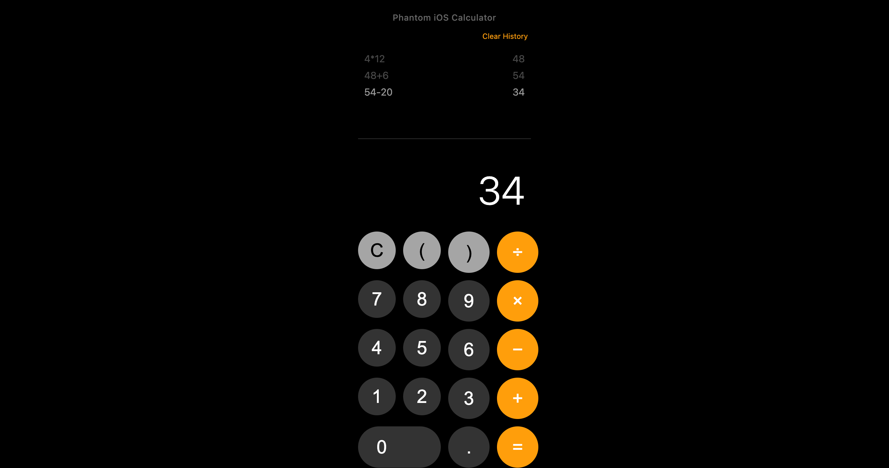

# Phantom iOS Calculator

A sleek, iOS-inspired calculator web application with calculation history functionality. This calculator mimics the design and feel of the iOS calculator while adding extra features like calculation history.



## Features

- iOS-style interface
- Calculation history
- Basic arithmetic operations
- Parentheses support
- Error handling
- Responsive design
- Clear history functionality

## Demo

Live demo: [[Add your demo link here](https://wayphantomme.github.io/Phantom-iOS-Calculator/)]

## Technologies Used

- HTML5
- CSS3
- JavaScript (Vanilla)

## Project Structure

```plaintext
phantom-ios-calculator/
│
├── index.html
├── styles.css
├── script.js
└── README.md
```

## Installation

1. Clone the repository:
```bash
git clone https://github.com/yourusername/phantom-ios-calculator.git
```

2. Navigate to the project directory:
```bash
cd phantom-ios-calculator
```

3. Open `index.html` in your web browser or use a live server.

## Usage

### Basic Calculations
```javascript
// Examples of supported operations:
5 + 3 = 8
10 - 4 = 6
8 × 2 = 16
15 ÷ 3 = 5
```

### Using Parentheses
```javascript
// Example of complex calculations:
(5 + 3) × 2 = 16
8 ÷ (2 + 2) = 2
```

## Code Examples

### HTML Structure
```html
<div class="calculator">
    <div class="clear-history" onclick="clearHistory()">Clear History</div>
    <div class="history" id="history"></div>
    <div class="display" id="display">0</div>
    <div class="buttons">
        <!-- Calculator buttons -->
    </div>
</div>
```

### CSS Styling
```css
.calculator {
    background-color: #000;
    max-width: 320px;
    width: 100%;
    padding: 20px;
    user-select: none;
}

.display {
    height: 120px;
    color: #fff;
    font-size: 64px;
    font-weight: 300;
}
```

### JavaScript Functions
```javascript
// Calculate function example
function calculate() {
    try {
        let expression = currentInput
            .replace(/×/g, '*')
            .replace(/÷/g, '/')
            .replace(/−/g, '-');
        let result = eval(expression);
        
        // Format result
        if (Number.isInteger(result)) {
            result = result.toString();
        } else {
            result = result.toFixed(8).replace(/\.?0+$/, '');
        }

        // Update history and display
        updateCalculationHistory(currentInput, result);
        currentInput = result;
        updateDisplay();
    } catch (error) {
        handleCalculationError();
    }
}
```

## Features Explanation

### History System
- Stores up to 10 recent calculations
- Displays both the expression and result
- Clear history option
- Automatic scrolling to latest calculation

### iOS Design Elements
- Circular buttons with proper spacing
- Original iOS color scheme
- System font implementation
- Responsive touch feedback
- Custom scrollbar design

## Browser Support

- Chrome (latest)
- Firefox (latest)
- Safari (latest)
- Edge (latest)

## Contributing

1. Fork the project
2. Create your feature branch (`git checkout -b feature/AmazingFeature`)
3. Commit your changes (`git commit -m 'Add some AmazingFeature'`)
4. Push to the branch (`git push origin feature/AmazingFeature`)
5. Open a Pull Request

## License

This project is licensed under the MIT License - see the [LICENSE.md](LICENSE.md) file for details.

## Acknowledgments

- Inspired by iOS Calculator design
- Built for educational purposes
- Thanks to contributors and testers

## Contact

Phantom Megaditha - [@wayphantomme](https://twitter.com/wayphantomme)

Project Link: [https://github.com/yourusername/phantom-ios-calculator](https://github.com/wayphantomme/phantom-ios-calculator)
